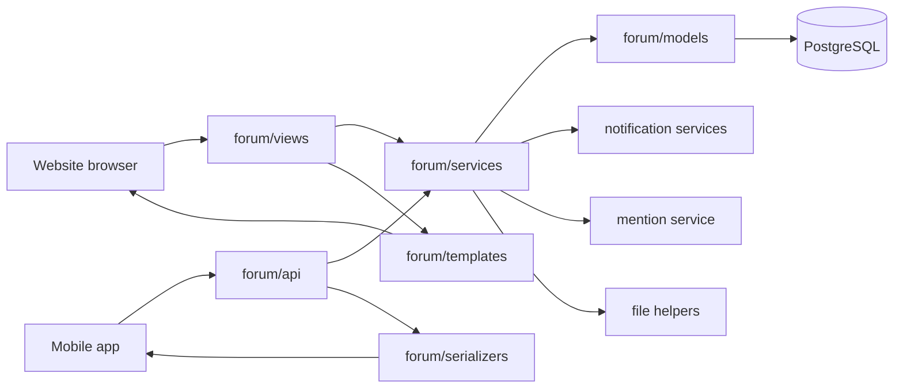
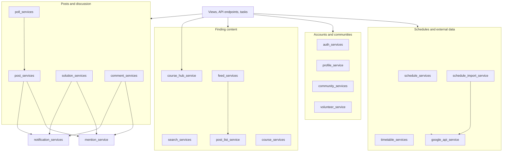
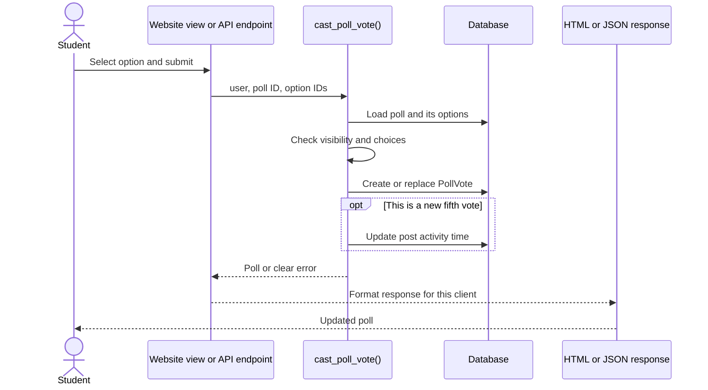
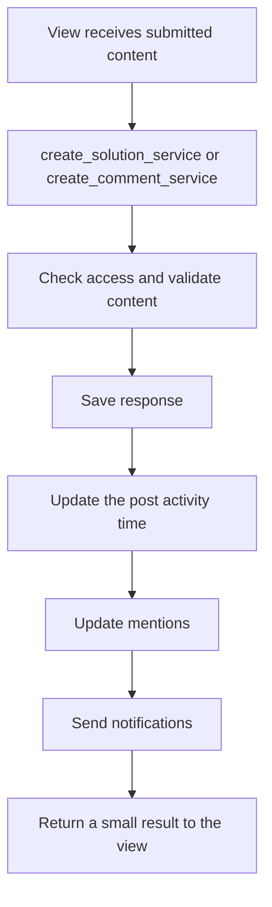

# WolfKey architecture

WolfKey uses a simple request-to-action flow. Website views and mobile API
endpoints handle different input and output formats, but they call the same
service function when they perform the same action.



## Service map

The service files are grouped below by the kind of feature they implement.
Arrows show the important calls between groups, rather than every Python import.



## What belongs in each layer

| Location | Responsibility | Example |
| --- | --- | --- |
| `forum/views` | Read an HTTP request and return an HTML page or redirect | Read form fields for a poll vote |
| `forum/api` | Read an API request and return JSON | Read `selected_option_ids` from mobile |
| `forum/services` | Perform a complete user action | Validate and save a poll vote |
| `forum/models` | Define stored data and small data-specific behavior | Define `PollVote.selected_options` |
| `forum/serializers` | Convert models to and from API data | Build the poll JSON response |
| `forum/signals.py` | Protect lifecycle invariants across every write path | Delete uploaded files during a cascade |
| `forum/context_processors.py` | Read shared data needed by the site layout | Show unread notifications |

## Service action results

User-facing service actions return a dictionary containing their result on
success. On failure they return `{'error': 'Readable message', 'status': 400}`.
Use 404 for a missing object, 403 for denied access, 409 for a conflict, and
500 for an unexpected failure. `service_error()` and `service_success()` in `forum/services/results.py`
build these dictionaries. Views and API endpoints turn the result into their
own response format and use the returned status; services do not construct
HTTP responses or add Django messages. Read-only query helpers and external
provider adapters can still return their natural data type.

## Website fetch response envelope

Website fetch endpoints that return JSON use one outer shape:

```json
{
  "success": true,
  "message": null,
  "data": {},
  "error_code": null
}
```

Every response includes all four keys. On success, `data` contains the
endpoint result and `error_code` is `null`; `message` is a short user-facing
message when useful and otherwise `null`. On failure, `success` is `false`,
`message` explains the failure, `data` is `null`, and `error_code` is a stable
machine-readable value. The HTTP status must agree with `success`: 2xx for
success and 4xx/5xx for failure. A response with a body uses a status such as
200 or 201; 204 is reserved for an empty response.

`forum.views.json_responses` builds this envelope for website views. Keep
endpoint-specific fields inside `data`, and have fetch callers check
`response.ok` and `success` before reading it. Website profile, discussion,
post action, schedule, Atlas, mention, and community
fetch flows use this contract. Editor.js image uploads retain the response
shape required by Editor.js (`success: 1` and `file.url`). HTML fragments and
redirects remain HTML responses. The `/api/` endpoints used by mobile are a
separate contract and must be migrated together with their mobile callers.

## Example: voting on a poll

The website and API parse requests differently. Both call one action, so poll
validation and feed activity rules have a single home.



## Example: creating a response



These steps stay explicit in the service. Saving a `Solution` or `Comment`
directly does not secretly reorder the feed.

## Signals and startup behavior

Signals are limited to rules that must run when an object changes through any
path, including Django admin, scripts, and cascading deletes:

- every user has a profile;
- inactive users lose API tokens;
- files referenced by deleted posts, solutions, and comments are cleaned up.

Feature rules such as notifications, mentions, voting, and feed activity belong
in service functions. `ForumConfig.ready()` only registers the lifecycle
signals; it does not fetch remote data or modify the database.

Moderator access has one source of truth: `UserProfile.is_moderator`. The user
model exposes it as `user.is_moderator` for templates. Migration `0071` copies
members of the old `Moderators` group into that field before the old middleware
is removed.

The schedule cache is refreshed explicitly with:

```bash
python manage.py rebuild_schedule_cache
```

Run that command when the source schedule changes. Normal reads use the current
cache. A fresh deployment without a cache file looks up the requested date in
the sheet on first use.
